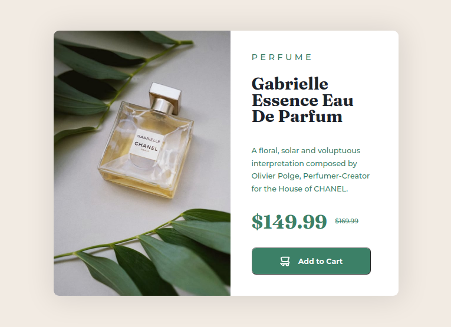

# Frontend Mentor - Product preview card component solution

## Table of contents

- [Overview](#overview)
  - [Screenshot](#screenshot)
  - [Links](#links)
- [My process](#my-process)
  - [Built with](#built-with)
  - [What I learned](#what-i-learned)
  - [Continued development](#continued-development)
- [Author](#author)

---

## Overview

### Screenshot

### Links

- Solution URL: https://github.com/JojoRider/FEM-product-preview-card-component
- Live Site URL: https://jojorider.github.io/FEM-product-preview-card-component/

---

## My process

1. Analyse of the design schema to identify the different sections and how to built the right sections in the HTML file
2. First version of sections and classes
3. Starting of building the style in CSS, from top to bottom. No major issue here, except for the image size
4. First version was only for desktop, so I looked on how to make it responsive for mobile
5. Research, testing, failing and finally working with different pictures depending on the size of the screen
6. Got back on the code after a few days to refine it and add some features

### Built with

- Semantic HTML5 markup
- CSS custom properties
- Flexbox
- Desktop first

### What I learned

Usage of "picture" and its utility to set up multiple content depending of the size of the viewer.

Learned a bit more about the size units we can use in CSS.

Transition and hovering as well.

### Continued development

I have not yet started to learn the specificities of mobile first development (will come later in my path) but discovering it bit by bit!

---

## Author

- Frontend Mentor - [@JojoRider](https://www.frontendmentor.io/profile/JojoRider)